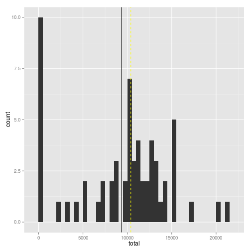
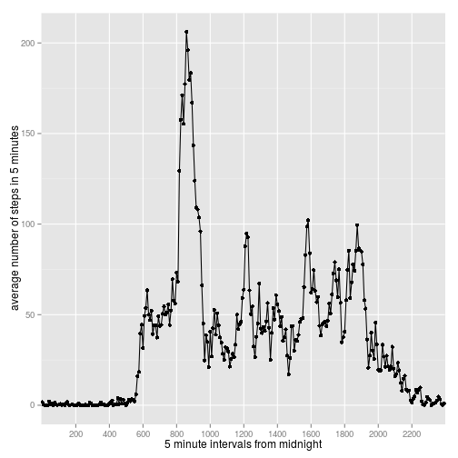
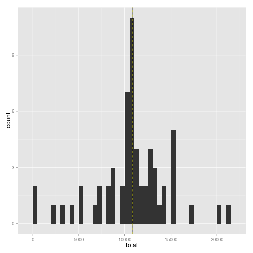
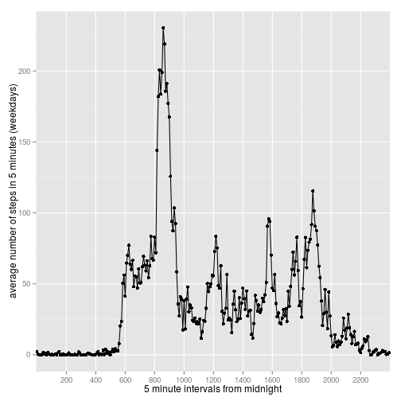
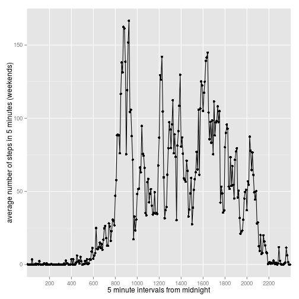

## Loading and preprocessing the data

```r
### read the data:
unzip("activity.zip")
df <- read.csv("activity.csv", colClasses=c("numeric", "Date", "numeric"))
df$interval <- factor(df$interval)
### process/transform the data:
# add column indicating whether date is weekend or not
isWeekend <- function(date) {
        weekdays(date) %in% c("Saturday", "Sunday")
}
df$daytype <- factor(isWeekend(df$date)+1L, levels=1:2, labels=c("weekday", "weekend"))

# show final data structure
str(df)
```

```
## 'data.frame':	17568 obs. of  4 variables:
##  $ steps   : num  NA NA NA NA NA NA NA NA NA NA ...
##  $ date    : Date, format: "2012-10-01" "2012-10-01" ...
##  $ interval: Factor w/ 288 levels "0","5","10","15",..: 1 2 3 4 5 6 7 8 9 10 ...
##  $ daytype : Factor w/ 2 levels "weekday","weekend": 1 1 1 1 1 1 1 1 1 1 ...
```

## What is mean total number of steps taken per day?

```r
library(dplyr)
stepsByDate <- (df %>% group_by(date) %>% summarise(total=sum(steps, na.rm=T)))
```
### Mean steps per day (solid black line):

```r
mn = mean(stepsByDate$total)
print(mn)
```

```
## [1] 9354.23
```
### Median steps per day (dashed yellow line):

```r
mdn = median(stepsByDate$total)
print(mdn)
```

```
## [1] 10395
```
### Plot of steps per day:

```r
library(ggplot2)
ggplot(stepsByDate, aes(total)) + geom_histogram(binwidth=500) +
        geom_vline(x=mn, col="black", linetype="solid") +
        geom_vline(x=mdn, col="yellow", linetype="dashed")
```

 

## What is the average daily activity pattern?

```r
library(dplyr)
stepsByInterval <- (df %>% group_by(interval) %>% summarise(avgsteps=mean(steps, na.rm=T)))
library(ggplot2)
qplot(interval, avgsteps, data=stepsByInterval, group=1,
      xlab="5 minute intervals from midnight",
      ylab="average number of steps in 5 minutes") + 
        scale_x_discrete(breaks=paste(seq(0, 23, 2), "00", sep="")) +
        geom_line()
```

 

### Interval with maximum average number of steps across all days, [h]hmm:

```r
maxidx <- which(stepsByInterval$avgsteps == max(stepsByInterval$avgsteps))
print(as.character(stepsByInterval[maxidx,]$interval))
```

```
## [1] "835"
```

## Imputing missing values

Note that there are a number of days/intervals where there are missing
values (coded as `NA`). The presence of missing days may introduce
bias into some calculations or summaries of the data.

1. Calculate and report the total number of missing values in the dataset (i.e. the total number of 
rows with `NA`s)

### Total number of records with missing values:

```r
sum(is.na(df$steps))
```

```
## [1] 2304
```
### Ratio of records with missing values:

```r
mean(is.na(df$steps))
```

```
## [1] 0.1311475
```

2. Devise a strategy for filling in all of the missing values in the dataset. The strategy does not 
need to be sophisticated. For example, you could use the mean/median for that day, or the mean for that 5-minute interval, etc.

Using the mean for the 5-minute interval.

3. Create a new dataset that is equal to the original dataset but with the missing data filled in.


```r
avgstepsByInterval <- structure(stepsByInterval$avgsteps, names = stepsByInterval$interval)
df2 <- df
df2$steps <- ifelse(is.na(df$steps), avgstepsByInterval[df$interval], df$steps)
```

4. Make a histogram of the total number of steps taken each day and Calculate and report the **mean**
and **median** total number of steps taken per day. Do these values differ from the estimates from
 the first part of the assignment? What is the impact of imputing missing data on the estimates of the total daily number of steps?


```r
stepsByDateAdj <- (df2 %>% group_by(date) %>% summarise(total=sum(steps)))
```
### Mean steps per day (plain black line):

```r
mn2 = mean(stepsByDateAdj$total)
print(mn2)
```

```
## [1] 10766.19
```
### Median steps per day (dashed yellow line):

```r
mdn2 = median(stepsByDateAdj$total)
print(mdn2)
```

```
## [1] 10766.19
```
### Plot of steps per day:

```r
library(ggplot2)
ggplot(stepsByDateAdj, aes(total)) + geom_histogram(binwidth=500) +
        geom_vline(x=mn2, col="black", linetype="solid") +
        geom_vline(x=mdn2, col="yellow", linetype="dashed")
```

 

The assumptions for NAs clearly make a significant impact on the shape of the histogram and the values for mean and median.

## Are there differences in activity patterns between weekdays and weekends?

```r
library(ggplot2)
stepsByInterval2wd <- (df2 %>% filter(daytype=="weekday") %>% group_by(interval) %>% summarise(avgsteps=mean(steps, na.rm=T)))
stepsByInterval2we <- (df2 %>% filter(daytype=="weekend") %>% group_by(interval) %>% summarise(avgsteps=mean(steps, na.rm=T)))
str(stepsByInterval2wd)
```

```
## Classes 'tbl_df', 'tbl' and 'data.frame':	288 obs. of  2 variables:
##  $ interval: Factor w/ 288 levels "0","5","10","15",..: 1 2 3 4 5 6 7 8 9 10 ...
##  $ avgsteps: num  2.251 0.445 0.173 0.198 0.099 ...
```

```r
str(stepsByInterval2we)
```

```
## Classes 'tbl_df', 'tbl' and 'data.frame':	288 obs. of  2 variables:
##  $ interval: Factor w/ 288 levels "0","5","10","15",..: 1 2 3 4 5 6 7 8 9 10 ...
##  $ avgsteps: num  0.21462 0.04245 0.01651 0.01887 0.00943 ...
```

```r
qplot(interval,avgsteps, data=stepsByInterval2wd,
      xlab="5 minute intervals from midnight",
      ylab="average number of steps in 5 minutes (weekdays)", group=1) + 
        scale_x_discrete(breaks=paste(seq(0, 23, 2), "00", sep="")) +
        geom_line()
```

 

```r
qplot(interval,avgsteps, data=stepsByInterval2we,
      xlab="5 minute intervals from midnight",
      ylab="average number of steps in 5 minutes (weekends)", group=1) + 
        scale_x_discrete(breaks=paste(seq(0, 23, 2), "00", sep="")) +
        geom_line()
```

 

The plots display noticable difference in the average activity between weekdays and weekends.
